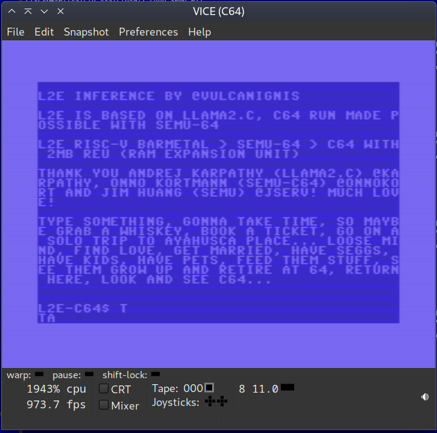

# L2E llama2.c on Commodore C-64

Have you ever wanted to inference tiny stories on a C64 while going about your daily life and then return after many years to read a story? No? Well, as luck would have it, now YOU CAN!



This is so slow, that even at ~3000% warp speed on VICE, it took ~25 minutes for two tokens as seen in the screenshot above until I killed it:

```
real    24m58.808s
user    24m34.952s
sys     0m23.208s
```
So that could mean hours, days and weeks on a real C64.

# How this works

Figured out that if Onno Kortman could run Linux on a C64 with his fork of semu called semu-c64, then I could build a baremetal RISC-V version of L2E and run the L2E binary instead of the linux kernel on semu-c64...

1. A L2E RISC-V baremetal executable file with model included (btw, L2E folks invented single file llms or slms and not Mozilla) is converted to a REU image file (l2e_c64.reu). 


2. It is pre loaded into the C64 REU (RAM Expansion Unit).


3. Then semu-c64 is run. semu-c64 is a RISC-V emulator and it loads the L2E executable from REU and executes it.


This is a utility fork of [semu-c64](https://github.com/onnokort/semu-c64) for a [L2E](https://github.com/trholding/llama2.c) demo on C64 with 2MB REU with the following changes and additions:

* Added runq_semu.bin L2E RISC-V baremetal binary with 240k 8bit model included
* Added mk_l2e_reu.py based on mk_linux_reu.py to create a 2MB REU file / image
* Removed verbose semu-c64 logging for clean demo
* Added pre-compiled semu

L2E Inference by @vulcanignis. L2E is based on llama2.c, c64 run made possible with semu-64

# How to run

## VICE

* Go to Preferences > Settings > Cartridges > RAM Expansion Module
+ Enable it
+ Select the file l2e_c64.reu
+ Select (2MiB)
+ Save settings.

Then do:

```
x64 semu
```

Enable warp mode or use custom emulation speed for the fastest possible emulation.

If you can transfer the semu binary to a real C64 (floppy?) and copy the l2e_c64.reu contents to real REU, then you may probably be able to run it on real hardware, but it would take ages to spit out tokens.

But you say this is emulation but not native C64? A native version of L2E is coming soon, so far I couldn't wrap my head around bank switching and splitting model data in banks and stitching it together etc, so native version almost compiles, but not yet. 

The last time I saw a C64 was probably when I was in 3rd or 4rth grade and that was when I saw a computer so close for the first time in my life... So full circle. 

For Fun & For Love!

# Gratitude

Thank you, 
* Andrej karpathy (llama2.c) @karpathy,
* Onno Kortmann (semu-c64) @onnokort,
* Jim Huang (semu) @jserv 
* And the LLVM MOS team!

Much love!

# Related 

[L2E](https://github.com/trholding/llama2.c) - Llama 2 Everywhere (L2E)

[llama2.c](https://github.com/karpathy/llama2.c) - Inference Llama 2 in one file of pure C

[semu-c64](https://github.com/onnokort/semu-c64) - risc-v emulator that runs on c64

[semu](https://github.com/sysprog21/semu) - risc-v emulator

[llvm-mos](https://github.com/llvm-mos/) - compiler for MOS targets